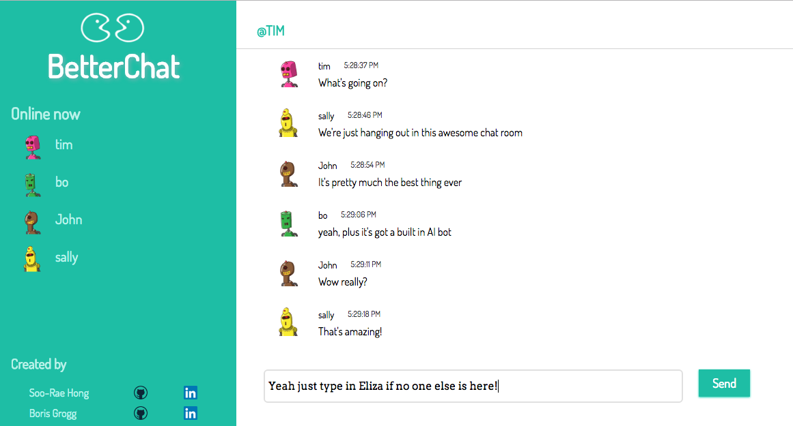

# BetterChat

[Live Demo](http://betterchat.herokuapp.com/)

##Description

BetterChat is an agile, lightning fast communication tool + AI Psychotherapy Bot built by Soo-Rae Hong and Boris Grogg.

Betterchat is built with Go. Go (or Golang) is an open-source language developed by Google with small runtime, simple framework, and concurrency primitives that allow for advanced, concurrent multi-thread handling. Betterchat supports concurrent readers and writers with the use of a third-party WebSockets package developed for Go (Gorilla Toolkit), and can optimize efficiency even under high load. Betterchat provides a pleasant, intuitive user interface built entirely in JavaScript and HTML5.

Betterchat also has a built-in chatbot with Artificial Intelligence features based on the Eliza natural language processing program developed by Joseph Weizenbaum at MIT (more below).

While there are several examples of Go chat applications currently out there, very few, if any, come with a browser-supported user interface, and even fewer that support both multi-user chat as well as AI. BetterChat makes it easy for users to access the power of Go, without having to load and run programs locally from their command line.

##How to Use

Enter the Betterchat Room at the link above.
Upon entering the site, the user is greeted with a welcome modal that prompts the user for a username:


The username assigns an avatar to the user based on the name entered, and users can see who else is currently on the site in the sidebar. This list is updated in real time whenever another user enters or leaves the site. Users can then chat with friends over the internet in instant time (open two browsers and place them side by side to see just how fast Betterchat can be!)...



...or they can chat with BetterChat's customized AI bot, Eliza, who parses user's messages and conducts relevant substitutions and syntax transformation to mimic the behavior of a non-directional psychotherapist, with a modern twist:


##Technologies
* Server architecture built using Go programming language
* Data is transferred from Server to Client using Websocket connections (through third-party package gorilla/websockets)
* Client-side is rendered using JavaScript and HTML5
* The skeleton for Eliza was integrated from [necrophonic's own implementation](https://github.com/necrophonic/go-eliza) of the [famous Eliza bot](https://en.wikipedia.org/wiki/ELIZA), first seen in 1964, with several updates and customizations to make the AI bot more 'relatable'
* Avatars unique to the user's IP address were provided from [Robohash.org](https://robohash.org/)
* Lastly, the project is deployed to Heroku for users to access easily from the internet

##Technical implementation

###Handling Connections
To connect the user and assign it a WebSocket, Betterchat hosts a server via its ```main.go``` file. Within this file, the ```main()``` function first serves the initial http GET request with the files in the ```/public``` directory, which holds the JavaScript ```app.js``` file. Upon document load, this JS file creates a new WebSocket at the path and appends '/ws' to it. Back on the ```main.go``` file, our ```main()``` function then handles any path with '/ws' with its ```handleConnections()``` function, which upgrades the WebSocket to a Gorilla WebSocket. The ```defer ws.Close()``` function allows the ```handleConnections()``` function to end only after everything else has been completed and the function returns, essentially when the user closes out of the window or if there is a server error.

 This saves us from having to write multiple "Close()" statements depending on how the function returns.

We next register our new client by adding it to the global "clients" map we created earlier.

```
func handleConnections(w http.ResponseWriter, r *http.Request){
  ws, err := upgrader.Upgrade(w, r, nil)
  if err != nil{
    log.Fatal(err)
  }
  defer ws.Close()
...
}
```

Another thing to note is that Go's ability to handle concurrent events allow our server to handle multiple incoming connections without having to wait for another connection to finish. Go is awesome!

###Handling Messages
Next comes an infinite loop that continuously waits for a new message to be written to the WebSocket, unserializes it from JSON to a Message object and then throws it into the broadcast channel. Our "handleMessages()" goroutine (described below) can then take it can send it to everyone else that is connected.

If there is some kind of error with reading from the socket, we assume the client has disconnected. We log the error and remove that client from our global "clients" map so we don't try to read from or send new messages to that client.


```
for{
  var msg Message
  var elizamsg Message

  err := ws.ReadJSON(&msg)
  if err != nil {
    log.Printf("error: %v", err)
    delete(clients, ws)
    break
  }
  ...
    broadcast <- msg
      ...
      }
    }
  ...
  ...
```

We use a goroutine called "handleMessages()" to send each of our messages to the client via a Go channel called ```broadcast```. This is a concurrent process that runs simultaneously with the rest of the application that will only take messages from the broadcast channel from before and then pass them to clients over their respective WebSocket connection.

It is simply a loop that continuously reads from the "broadcast" channel and then relays the message to all of our clients. Again, if there is an error with writing to the WebSocket, we close the connection and remove it from the "clients" map.

```
func handleMessages() {
   for {
     msg := <-broadcast

     for client := range clients {

       err := client.WriteJSON(msg)
       if err != nil {
         log.Printf("error: %v", err)
         client.Close()
         delete(clients, client)
       }
     }
   }
}
```

All information from each user, including whether a user has entered or left the site, is handled by passing Message structs to the WebSocket connection (defined as ```conn``` on the front end). This allows our Go chat server to receive any change to any user's status and immediately update all connected clients. The ```Message``` struct is defined on our ```main.go``` file as follows:
```
type Message struct{
  CurrentUsers []string `json:'currentusers'`
  NewUser string `json:"newuser"`
  Username string `json:"username"`
  Message string `json:"message"`
  UserLeft string `json:"userleft"`
}

```


###User List
One of the major challenges our team faced was how to display all the users currently online when a new user enters the site. All other examples available online either did not have a users list (users were only revealed if one sent a message after connecting), or utilized a database to store users. Wanting to keep the application light and fast, without querying any databases, we ultimately decided to have this on-load information also handled by ```handleConnections()```.

Knowing that any new Message object sent to the WebSocket connection would be updated via broadcast channel, we built a conditional within the function to check if a new user had connected, and performed two things. One, it assigned a string to the ```map``` type of ```clients``` that stored the ```username```, and then it iterated through the ```clients``` map and stored each username into the array. This array was then added to the ```Message``` currently being received, and then sent along to the ```broadcast``` channel, which would update it for all connected clients, including the one who just logged in, and display a list of all users currently connected.

This method also allowed us keep all the logic and updating on our Go functions, eliminating the need for the JavaScript file to perform much logic on its end. Prior to this change, the JS would wait for a ```message.NewUser``` or ```message.UserLeft``` and then add or delete  a ```div``` on the User List. But with all updates being sent via a new Message, the JavaScript only needs to wait for an updated ```CurrentUsers``` array to be sent over via the Message, and then update its render accordingly. That being said, the JavaScript did still handle the 'sending' of a new Message object whenever a user closed the connection, via a `window.onbeforeunload` function.

###AI Chatbot  
Another challenge we faced was how to integrate the Eliza bot into the chat app,  having her appear only when there was one user connected, be summoned, and process the input and outputting of messages. Again, it made the most sense to store all the Eliza logic on our Go file. And in fact, the way we had constructed our ```Message``` type and sending pattern, which took a ```username``` and ```message```  allowed multiple different messages to be sent from different 'users' (by specifying a different username) via the Go file, without having to create a new User object for Eliza or creating any dummy connections.

The implementation of Eliza was performed within the ```for``` loop, which ascertained when there was only one user connected (stored in the ```clients``` map as two WebSockets, hence ```len(clients) == 2```, and then waited for a ```Message.message``` with the value of 'Eliza?'. Upon this cue, Eliza would be turned 'on' (another variable stored on the ```main.go``` file), and she would then take in any message that was sent, analyze its keywords via nested regex operations, sort the keywords by weight, and select from various assemblies that are determined in the ```script.go``` file, which borrows heavily from Necrophonic's code. Once a response is formed using the algorithms in the ```eliza.go``` file, the response is sent via a new ```Message``` with ```username``` 'Eliza' to the broadcast.  

```
if len(clients) == 2 && msg.Message == "Eliza?" {
      elizaOn = true
      elizamsg.Username = "Eliza"
      elizamsg.Message ="I'm here! What do you want to talk about?"
    }

if elizaOn && msg.Message != "" && msg.Message != "Eliza?"{
      response, err := eliza.AnalyseString(msg.Message)
      if err!= nil {
        panic(err)
      }
      elizamsg.Username = "Eliza"

      elizamsg.Message = response
    }
```

###Server
The Betterchat server can be run both locally via localhost:8000, or through the public access Heroku web server by commenting out the appropriate ```import```, ```determineLIstenAddress()```, and ```main()``` functions on the ```main.go``` file.

##Features to be Implemented in the Future

* Private Messaging
* Emojis
* Stored chats that persist to a database
* Notifications when a user enters/exits
* Multiple rooms or channels
* Refactoring with separate User and Message packages to handle user logic.

##Disclaimer
This is our first crack at using the Go Programming language. It was a lot of fun and a great way to learn. We welcome any feedback and suggestions for improving the efficiency, readability, and overall structuring and syntax of our code.

##Acknowledgements
Chat Application Inspiration
- [Scotch.io website on how to build a chat server](https://scotch.io/bar-talk/build-a-realtime-chat-server-with-go-and-websockets)
- [Andrew Gerrand's 2012 Talk on Go: Code that Grows with Grace](https://talks.golang.org/2012/chat.slide#1)

Eliza Inspiration
- [Original Paper by Jospeh Weizenbaum, 1966](http://www.cse.buffalo.edu/~rapaport/572/S02/weizenbaum.eliza.1966.pdf)
- [Necrophonic's Implementation of Eliza]((https://github.com/necrophonic/go-eliza))

Avatars
- [Robohash.org](https://robohash.org/)

WebSockets
- [Gorilla WebSockets](https://github.com/gorilla/websocket)
